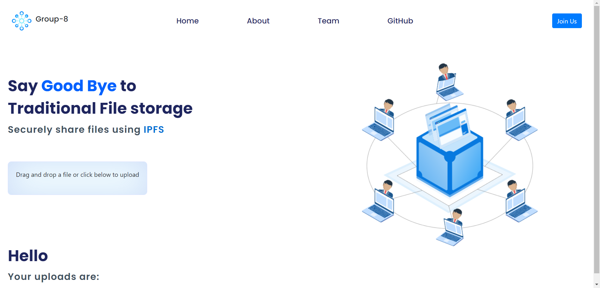

# IPFS-web

The purpose of this project is to develop a decentralized file sharing application using the InterPlanetary File System (IPFS) protocol. The project aims to leverage the benefits of IPFS, such as distributed storage, content addressing, and improved resilience, to provide a secure and efficient file sharing solution.

Traditional file sharing systems often rely on centralized servers, which can be vulnerable to failures, censorship, and privacy concerns. In contrast, decentralized file sharing using IPFS allows files to be stored and shared across a network of interconnected nodes without depending on a central authority. IPFS utilizes a content-addressable storage model, where files are identified and retrieved based on their unique cryptographic hash called a Content Identifier (CID).

